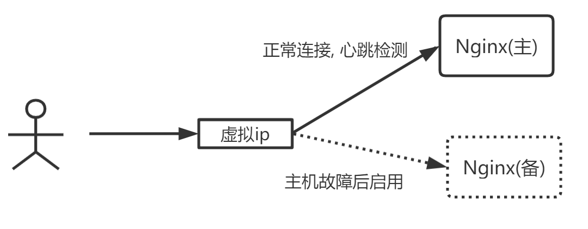

# Nginx的进程模型

主进程：master

工作进程：worker

```bash
# 信号
./nginx -s reload
./nginx -s stop
./nginx -s quit
./nginx -t
```


# Worker抢占机制


# 事件处理

> 传统服务器

传统的服务器worker来处理client连接的进程，多client连接会单独处理一个client连接，同步阻塞其他client连接。(BIO)


> Nginx

异步非阻塞处理client连接请求，一个worker可以同时处理多client。


# Nginx.conf配置结构


```txt
-- main 全局配置
	  -- event	配置工作模式以及连接数
	  -- http	http模块相关配置
		   -- server 虚拟主机配置，可以有多个
		  	  -- location 路由规则，表达式
		  	  -- upstream 集群，内网服务器
```

# Nginx的模块化体系


# Nginx配置

> 跨域

server中添加一下配置

```bash
# 允许跨域请求的域， *代表所有
add_header 'Access-Control-Allow-Origin' *;
# 允许带上cookie请求
add_header 'Access-Control-Allow-Credentials' 'true';
# 允许请求的方法，比如：GET/POST/PUT/DELETE
add_header 'Access-Control-Allow-Methods' *;
# 允许请求的header
add_header 'Access-Control-Allow-Headers' *;
```

> 防盗链

server中添加一下配置

```bash
# 对源站点验证
valid_referers none *.imooc.com
# 非法引入会进入下方判断
if ($valid_referers) {
	return 404;
}
```

|    参数名    |                             含义                             |
| :----------: | :----------------------------------------------------------: |
|     none     |               允许没有http_refer的请求访问资源               |
|   blocked    |        允许不是http://开头的，不带协议的请求访问资源         |
| server_names | 表示一个或多个主机名称。从Nginx 0.5.33版本开始，server_names中可以使用通配符"*"号。 |

# Linux定时任务

1. 命令

```bash
service crond start   //启动服务
service crond stop    //关闭服务
service crond restart //重启服务
service crond reload  //重新载入配置
crontab -e   //编辑任务
crontab -l   //查看任务列表
```

2. 表达式（* * * * *）

|          | 分   | 时   | 日   | 月   | 星期几 | 年（可选） |
| -------- | ---- | ---- | ---- | ---- | ------ | ---------- |
| 取值范围 | 0-59 | 0-23 | 1-31 | 1-12 | 1-7    | 2018/2019  |

# Nginx集群和负载均衡

- **二层负载**均衡会通过一个虚拟 MAC 地址接收请求，然后再分配到真实的 MAC 地址；

- **三层负载**均衡会通过一个虚拟 IP 地址接收请求，然后再分配到真实的 IP 地址；

- **四层**通过虚拟 IP + 端口接收请求，然后再分配到真实的服务器；
- **七层**通过虚拟的 URL 或主机名接收请求，然后再分配到真实的服务器。

 所谓的四到七层负载均衡，就是在对后台的服务器进行负载均衡时，依据四层的信息或七层的信息来决定怎么样转发流量。

> 四层负载均衡（传输层）

1. F5 硬负载均衡
2. LVS 四层负载均衡
3. Haproxy 四层负载均衡
4. Nginx 四层负载均衡

> 七层负载均衡（应用层）

1. Nginx 七层负载均衡
2. Haproxy 七层负载均衡
3. Apache 七层负载均衡

> Nginx 配置Tomcat集群

```txt
# 配置上游服务器
upstream tomcats {
   server 192.168.8.117:8080;
   server 192.168.8.118:8080;
   server 192.168.8.119:8080;
}

server {
  listen       80;
  server_name  www.tomcats.com;
  location / {
        proxy_pass http://tomcats;
  }
}
```

> Nginx配置负载均衡策略

1. 轮询(默认)
2. 加权轮询

```txt
# weight数值越小,分配的请求数越小
upstream tomcats {
   server 192.168.8.117:8080 weight=1;
   server 192.168.8.118:8080 weight=2;
   server 192.168.8.119:8080 weight=5;
}
```

3. ip_hash
   - hash算法：hash(ip)%node_counts = index
   - hash算法带来的问题：当某服务器宕机后，hash算法需要重新计算，原来服务器的会话则会丢失。
   - 一致性hash算法解决某台服务器宕机带来的问题。 [一致性Hash算法](https://juejin.cn/post/6844903997900324878)
4. url_hash
5. least_conn

```txt
# hash算法使用key为IPv4地址的前三位，IPv6地址的全部。
The first three octets of the client IPv4 address, 
or the entire IPv6 address, are used as a hashing key. 

# 如果临时需要移除一台服务器，需要将那台服务器标记为down而不是直接删除。
# 否则不能继续沿用之前的hash算法，一些缓存信息和cookie都会失效。
If one of the servers needs to be temporarily removed, 
it should be marked with the down parameter 
in order to preserve the current hashing of client IP addresses.
```

```txt
upstream tomcats {
   ip_hash;
   server 192.168.8.117:8080;
   server 192.168.8.118:8080;
   server 192.168.8.119:8080;
}
upstream tomcats {
   ip_hash;
   server 192.168.8.117:8080 down;
   server 192.168.8.118:8080;
   server 192.168.8.119:8080;
}

upstream tomcats {
   hash $request_uri;
   server 192.168.8.117:8080;
   server 192.168.8.118:8080;
   server 192.168.8.119:8080;
}

upstream tomcats {
   least_conn;
   server 192.168.8.117:8080;
   server 192.168.8.118:8080;
   server 192.168.8.119:8080;
}
```


> upstream参数

- max_conns：每次处理请求的最大线程数。
- slow_start：慢启动，权重从0到指定，有利于服务器的恢复。
- down：标记该台服务器为不可用状态。
- backup：标记该台服务器为备用服务器，当主服务器不可用时，该服务器才会启用。
- max_fails：最大失败次数，默认值为1。与fail_timeout配合使用，当服务器宕机，连接请求数达到max_fails时，Nginx会拒绝与该服务器的连接请求，并等待fail_timeout之后，并重新尝试连接。不断循环往复，直到服务器恢复为止。
- fail_timeout：失败等待时间，默认10秒。

[参数说明](http://nginx.org/en/docs/stream/ngx_stream_upstream_module.html#service)

```txt
upstream tomcats {
   server 192.168.8.117:8080 max_conns=2;
   server 192.168.8.118:8080 max_conns=2;
   server 192.168.8.119:8080 max_conns=2;
}

upstream tomcats {
   server 192.168.8.117:8080 weight=6 slow_start=60s;
   server 192.168.8.118:8080 weight=2;
   server 192.168.8.119:8080 weight=2;
}
```

- keepalive：维系Http长连接，提高吞吐量

[keepalive文档](http://nginx.org/en/docs/http/ngx_http_upstream_module.html#keepalive)

```txt
upstream tomcats {
   server 192.168.8.116:8080;
   keepalive 32;
}

server {
  listen       80;
  server_name  www.tomcats.com;

  location / {
        proxy_pass http://tomcats;
        proxy_http_version 1.1;
        proxy_set_header Connection "";
  }
}
```

# Nginx的动静分离

- 优点
  - 分布式
  - 前后端解耦
  - 静态归Nginx
  - 接口服务化
- 问题
  - 跨域(Spring Boot, Nginx, jsonp)
  - 分布式会话

> 配置

```txt
location /static {
    alias   /home/imooc;
    expires 10s;
}
```

> expires指令

- expires [time]
- expires @[time] : @22h30m，指定过期的时间点
- expires -[time] : 提前过期时间
- expires epoch：没有使用缓存
- expires off：默认，关闭expires。（关闭Nginx的expires，但是浏览器有expires）
- expires max：最大过期时间。

> 设置反向代理缓存

```txt
# proxy_cache_path 设置缓存保存的目录
# keyszone 设置共享内存以及占用的空间大小
# max_size 设置缓存大小
# inactive 超出此时间, 则缓存自动清理
# use_temp_path 关闭临时目录
proxy_cache_path /usr/local/nginx/upstream_cache keys_zone=mycache:5m max_size=1g inactive=30s use_temp_path=off;

server {
  listen       80;
  server_name  192.168.8.116;

  # 开始并且使用缓存
  proxy_cache mycache;
  # 针对200和304状态码, 缓存过期的时间.
  proxy_cache_valid 200 304 8h;

  location / {
        proxy_pass http://tomcats;
  }
}
```

# Nginx配置HTTPS

```txt
server{
    listen 443;
    server_name www.imoocdsp.com;
    #开启ssl
    ssl on;
    #配置ssl证书 
    ssl_certificate 1_www.imoocdsp.com_bundle.crt;
    #配置证书秘钥
    ssl_certificate_key 2_www.imoocdsp.com.key;
    #ssl会话cache
    ssl_session_cache shared:SSL:1m;
    #ssl会话超时时间
    ssl_session_timeout 5m;
    #配置加密套件，写法遵循openssl标准 
    ssl_protocols TLSv1 TLSv1.1 TLSv1.2;
    ssl_ciphers ECDHE-RSA-AES128-GCM-SHA256:HIGH:!aNULL:!MD5:!RC4:!DHE; ssl_prefer_server_ciphers on; 

    location/{
        proxy_passhttp://tomcats/;
    }
}
```

# Nginx的高可用

> Keepalived概念

1. 解决单点故障
2. 组件免费
3. 可以实现高可用HA机制
4. 基于VRRP协议

## Keepalived双机主备

> Keepalived双机主备原理

主机宕机，备机启动。



> 配置

`vim /etc/keepalived/keepalived.conf`

```txt
! Configuration File for keepalived

global_defs {
   # 路由id: 当前安装keepalived节点主机的标识符,全局唯一
   router_id keep_116
}

vrrp_script check_nginx_alive {
    script "/etc/keepalived/check_nginx_alive_or_not.sh"
    interval  10 # 每隔两秒运行上一行脚本
    weight 10 # 如果脚本运行成功, 则升级权重+10
    # weight -10 # 如果脚本运行失败, 则降低权重-10
}

# 计算机节点
vrrp_instance VI_1 {
    # 表示的状态, 当前的116为nginx的主节点, MASTER/BACKUP
    state MASTER
    # 当前实例绑定的网卡
    interface ens33
    # 保证主备节点一致
    virtual_router_id 51
    # 优先级/权重, 谁的优先级高, 在MASTER挂掉以后, 就能成为MASTER
    priority 100
    # 主备之间同步检查的时间间隔, 默认1s
    advert_int 1
    # 认证授权的密码, 防止非法节点的进入
    authentication {
        auth_type PASS
        auth_pass 1111
    }
    
    track_script {
        check_nginx_alive  # 追踪nginx脚本
   }

    virtual_ipaddress {
        192.168.8.161
    }
}
```

> 检查Nginx是否存活

编写脚本检测Nginx是否宕机。

```bash
#!/bin/sh

nginxpid=$(ps -C nginx --no-header|wc -l)
#1.判断Nginx是否存活,如果不存活则尝试启动Nginx
if [ $nginxpid -eq 0 ];then
    /usr/local/nginx/sbin/nginx
    sleep 3
    #2.等待3秒后再次获取一次Nginx状态
    sleep 3
    nginxpid=$(ps -C nginx --no-header|wc -l)
    #3.再次进行判断, 如Nginx还不存活则停止Keepalived, 使其启动备用机
    if [ $nginxpid -eq 0 ];then
        killall keepalived
   fi
fi
```

## Keepalived双主热备

主机和备用机VIP均可提供服务。


> 配置

主服务器192.168.8.116

```txt
! Configuration File for keepalived

global_defs {
   # 路由id: 当前安装keepalived节点主机的标识符,全局唯一
   router_id keep_116
}

vrrp_script check_nginx_alive {
    script "/etc/keepalived/check_nginx_alive_or_not.sh"
    interval  10 # 每隔两秒运行上一行脚本
    weight 10 # 如果脚本运行成功, 则升级权重+10
    # weight -10 # 如果脚本运行失败, 则降低权重-10
}

# 计算机节点
vrrp_instance VI_1 {
    # 表示的状态, 当前的116为nginx的主节点, MASTER/BACKUP
    state BACKUP
    # 当前实例绑定的网卡
    interface ens33
    # 保证主备节点一致
    virtual_router_id 51
    # 优先级/权重, 谁的优先级高, 在MASTER挂掉以后, 就能成为MASTER
    priority 100
    # 主备之间同步检查的时间间隔, 默认1s
    advert_int 1
    # 认证授权的密码, 防止非法节点的进入
    authentication {
        auth_type PASS
        auth_pass 1111
    }
    
    track_script {
        check_nginx_alive  # 追踪nginx脚本
   }

    virtual_ipaddress {
        192.168.8.161
    }
}
# 计算机节点
vrrp_instance VI_2 {
    state BACKUP
    interface ens33
    virtual_router_id 52
    priority 80
    advert_int 1
    authentication {
        auth_type PASS
        auth_pass 1111
    }

   track_script {
        check_nginx_alive  # 追踪nginx脚本
   }

    virtual_ipaddress {
        192.168.8.162
    }
}
```

备用服务器192.168.8.110：

```txt
! Configuration File for keepalived

global_defs {
   # 路由id: 当前安装keepalived节点主机的标识符,全局唯一
   router_id keep_116
}

vrrp_script check_nginx_alive {
    script "/etc/keepalived/check_nginx_alive_or_not.sh"
    interval  10 # 每隔两秒运行上一行脚本
    weight 10 # 如果脚本运行成功, 则升级权重+10
    # weight -10 # 如果脚本运行失败, 则降低权重-10
}

# 计算机节点
vrrp_instance VI_1 {
    # 表示的状态, 当前的116为nginx的主节点, MASTER/BACKUP
    state BACKUP
    # 当前实例绑定的网卡
    interface ens33
    # 保证主备节点一致
    virtual_router_id 51
    # 优先级/权重, 谁的优先级高, 在MASTER挂掉以后, 就能成为MASTER
    priority 100
    # 主备之间同步检查的时间间隔, 默认1s
    advert_int 1
    # 认证授权的密码, 防止非法节点的进入
    authentication {
        auth_type PASS
        auth_pass 1111
    }
    
    track_script {
        check_nginx_alive  # 追踪nginx脚本
   }

    virtual_ipaddress {
        192.168.8.161
    }
}

# 计算机节点
vrrp_instance VI_2 {
    state MASTER
    interface ens33
    virtual_router_id 52
    priority 100
    advert_int 1
    authentication {
        auth_type PASS
        auth_pass 1111
    }
    
    track_script {
        check_nginx_alive  # 追踪nginx脚本
    }

    virtual_ipaddress {
        192.168.8.162
    }
}
```

# LVS + Nginx

> Why?

- LVS基于四层，工作效率高
- 单个Nginx承受不了压力，需要集群
- LVS充当Nginx集群的调度者
- Nginx接收请求来回，LVS可以只接收不响应

> 模式


> LVS高可用


# 总结

1. Nginx实现动静分离，管理Tomcat集群，实行7层的负载均衡，Keepalived为Nginx提供高可用。
2. LVS管理Nginx集群，实现4层的负载均衡，Keepalived为LVS提供高可用。